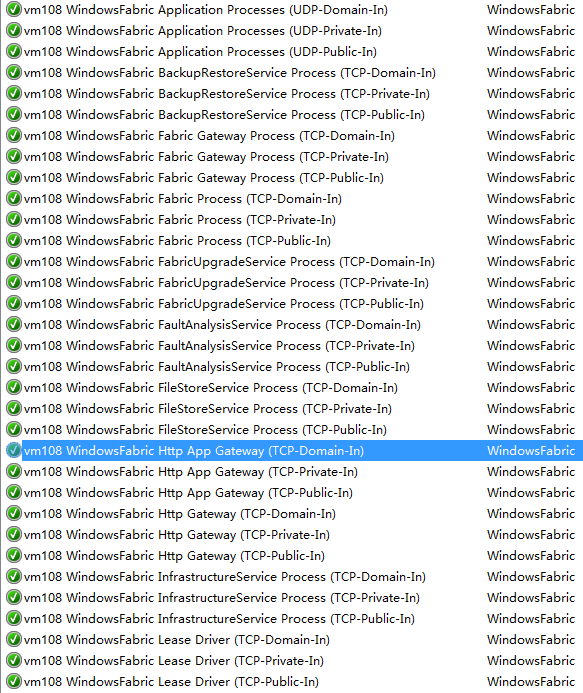
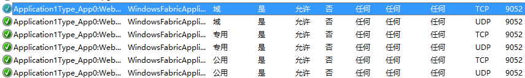
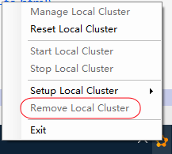

# 创建 Service Fabric 集群

自从了解到 Service Fabric 之后就开始对这个东西念念不忘，这个框架不但提供微服务开发支持，还简化了运维方面的工作。Service Fabric 支持 Java、可以跨平台部署并且已经开源了。

对于懒人来说当然最好是用 Azure 上的 Service Fabric 服务，无需自己做复杂的安装配置。然而，Azure 虽好，奈何在外网而且要花钱。Service Fabric 的一个巨大的好处是我们可以自己部署在内网，或者其他云计算提供商的云上。

# 创建开发用的 Cluster 

如果虚拟机没有连接互联网，则需要修改一些配置，可参考官方文档。参考[链接](https://docs.microsoft.com/en-us/azure/service-fabric/service-fabric-cluster-creation-for-windows-server)。

下载包之后创建开发用的 Cluster ，解压缩包并执行下面的 PowerShell 命令就可以创建开发用的 Cluster 。微软已经为我们准备好了对应的 config 和 PowerShell 脚本，只需要执行就好了。

```
.\CreateServiceFabricCluster.ps1 -ClusterConfigFilePath .\ClusterConfig.Unsecure.DevCluster.json -AcceptEULA
```

接下就是等待——可能是一个比较漫长的过程。

> 开发用的的 Cluster 我觉得还是下载 SDK ，通过 SDK 来安装比较好。

# 创建生产用的 Cluster

准备三台虚拟机，创建 `UnSecure` 的集群——相对 Secure 的集群，UnSecure 的集群会容易配置一点。如果想以后省事，先准备一台“干净”的虚拟机，只安装好操作系统和打好操作系统补丁，然后根据“准备工作”这一节的内容安装必要的软件和做必要的设置，然后将这个虚拟机制作为模板方便以后随时快速的添加节点。

## 准备工作

1. 每台虚机都安装 .NET 4.5 以上版本。我安装的是 .NET 4.7。
2. 每台虚拟机都安装 `Visual C++ Redistributable for Visual Studio 2015` ，从[这里](https://www.microsoft.com/en-us/download/details.aspx?id=48145)下载，这个是必须的。
3. 按照官方文档开启所需要的所有端口（135, 137, 138, 139, and 445），一般在防火墙中这些端口都已经配置好，只是默认是关闭的。集群用的那些什么 19000 之类的端口就不用管了，安装程序会为我们配置防火墙。
4. 所有虚拟机都开启 `Remote Registry Service` 服务。
5. 最后按照官方文档中 [Environment setup](https://docs.microsoft.com/en-us/azure/service-fabric/service-fabric-cluster-standalone-deployment-preparation) 一节检查每台 VM 的环境配置。

`Environment setup` 摘要如下，没什么好翻译的就不翻译了：

    The user creating the cluster should have administrator-level security privileges to all machines that are listed as nodes in the cluster configuration file.
    Machine from which the cluster is created, as well as each cluster node machine must:
    Have Service Fabric SDK uninstalled
    Have Service Fabric runtime uninstalled
    Have the Windows Firewall service (mpssvc) enabled
    Have the Remote Registry Service (remoteregistry) enabled
    Have file sharing (SMB) enabled
    * Have necessary ports opened, based on cluster configuration ports
    Have necessary ports opened for Windows SMB and Remote Registry service: 135, 137, 138, 139, and 445
    Have network connectivity to one another
    None of the cluster node machines should be a Domain Controller.
    If the cluster to be deployed is a secure cluster, validate the necessary security prerequisites are in place, and are configured correctly against the configuration.
    If the cluster machines are not internet-accessible, set the following in the cluster configuration:
    Disable telemetry: Under properties set "enableTelemetry": false
    Disable automatic Fabric version downloading & notifications that the current cluster version is nearing end of support: Under properties set "fabricClusterAutoupgradeEnabled": false
    Alternatively, if network internet access is limited to white-listed domains, the domains below are required for automatic upgrade: go.microsoft.com download.microsoft.com

> 默认情况下 2012 R2 的 SMB 服务是开启的，只是端口是关闭的。要想远程安装，SMB 相关的端口需要打开。而集群用的端口则可以留给 Service Fabric 自己开启。

> 原来 Service Fabric 安装程序会自己配置所需要端口：。

> Service Fabric 还会自动为你的 Service Endpoint 打开端口，例如你发布一个 Stateless 的 Web ，侦听端口为 9052，成功发布 Application 之后你可以看到 Windows 防火墙上已经开了相应端口。这可以节省不少运维工作量。 

## 一步一步创建集群
### 下载 Service Fabric 包

下载[地址](http://go.microsoft.com/fwlink/?LinkId=730690)，这个包里面有很多 Powershell 脚本，我们将通过执行这些 Powershell 脚本来完成安装操作。

### 解压缩，修改配置文件

包里有很多适合不同场景的 config 文件的示例，我们找一个适合我们的场景的文件稍作修改就可以用了。这是懒人福音。我尝试部署在内网环境，总共三台虚拟机，不加入安全认证方面的保护。所以选择的配置文件模板是 `ClusterConfig.Unsecure.MultiMachine.json`。

下面是参考配置：
```json
{
    "name": "SampleCluster",
    "clusterConfigurationVersion": "1.0.0",
    "apiVersion": "10-2017",
    "nodes": [
      {
        "nodeName": "vm106",
        "iPAddress": "192.168.3.106",
        "nodeTypeRef": "NodeType0",
        "faultDomain": "fd:/dc0/r0",
        "upgradeDomain": "UD0"
      },
      {
        "nodeName": "vm107",
        "iPAddress": "192.168.3.107",
        "nodeTypeRef": "NodeType0",
        "faultDomain": "fd:/dc0/r1",
        "upgradeDomain": "UD1"
      },
      {
        "nodeName": "vm108",
        "iPAddress": "192.168.3.108",
        "nodeTypeRef": "NodeType0",
        "faultDomain": "fd:/dc0/r2",
        "upgradeDomain": "UD2"
      }
    ],
    "properties": {
        "diagnosticsStore": 
        {
            "metadata":  "\\\\192.168.3.106\\DiagnosticsStore",
            "dataDeletionAgeInDays": "21",
            "storeType": "FileShare",
            "connectionstring": "\\\\192.168.3.106\\DiagnosticsStore"
        },
        "nodeTypes": [
          {
            "name": "NodeType0",
            "clientConnectionEndpointPort": "19000",
            "clusterConnectionEndpointPort": "19001",
            "leaseDriverEndpointPort": "19002",
            "serviceConnectionEndpointPort": "19003",
            "httpGatewayEndpointPort": "19080",
            "reverseProxyEndpointPort": "19081",
            "applicationPorts": {
                "startPort": "20001",
                "endPort": "20031"
            },
            "isPrimary": true
          }
      ],
      "fabricSettings": [
        {
          "name": "Setup",
          "parameters": [
            {
                "name": "FabricDataRoot",
                "value": "C:\\ProgramData\\SF"
            },
            {
                "name": "FabricLogRoot",
                "value": "C:\\ProgramData\\SF\\Log"
            }
          ]
        }
      ]
    }
}
```

> 需要按照实际情况修改配置文件，需要注意的是 `faultDomain` 和 `upgradeDomain` ，至少有两个不同的 domain 。如果有问题测试配置文件时会指出。

> 一次安装 N 个节点应该是最快的方法，但是我的尝试失败了。似乎无法远程启动程序。这种方式需要程序远程操作其他机器，在其他机器上写入文件、安装程序，可能是权限或者某些必要的端口、服务没有开——尽管我已经按照文档检查过一遍。该开的端口开了，该开的服务开了，有管理员权限。

> 失败的原因找到了，因为另外两个节点没有安装 `Visual C++ Redistributable for Visual Studio 2015`，导致程序无法运行。下文有下载链接。如果已经按照前文设置好了环境，应该不会遇到这个问题。

> 以上配置文件因为使用了文件共享方式做为 diagnosticsStore ，所以还需要在 192.168.3.106 上面创建共享文件夹，名为 diagnosticsStore，并保证所有节点通过此路径 `\\192.168.3.106\diagnosticsStore` 可读写。

### 测试配置文件

进入刚刚解压缩的目录，在 PowerShell 中执行以下命令：

``` powershell
.\TestConfiguration.ps1 .\ClusterConfig.Unsecure.MultiMachine.json
```

你可能会遇到类似以下的错误信息：

> 无法加载 DLL "FabricCommon.dll"：找不到指定模块……

试试[下载](https://www.microsoft.com/en-us/download/details.aspx?id=48145)并安装 `Visual C++ Redistributable for Visual Studio 2015`，更多信息可以参考 GitHub 上的[讨论帖子](https://github.com/Azure/service-fabric-issues/issues/539)。

如果一切正常会有类似如下的输出：

``` cmd
Trace folder already exists. Traces will be written to existing trace folder: C:\temp\Microsoft.Azure.ServiceFabric.WindowsServer\DeploymentTraces
Running Best Practices Analyzer...
Best Practices Analyzer completed successfully.

LocalAdminPrivilege        : True
IsJsonValid                : True
IsCabValid                 : True
RequiredPortsOpen          : True
RemoteRegistryAvailable    : True
FirewallAvailable          : True
RpcCheckPassed             : True
NoConflictingInstallations : True
FabricInstallable          : True
Passed                     : True
```

### 创建集群

执行以下命令创建集群：

``` powershell
.\CreateServiceFabricCluster.ps1 .\ClusterConfig.Unsecure.MultiMachine.json  -AcceptEULA
```

命令成功执行之后可以使用以下命令测试连通：

``` powershell
Connect-ServiceFabricCluster -ConnectionEndpoint 192.168.3.107:19000
```

### 安装管理客户端

微软提供了一个集群管理客户端，[Service Fabric Explorer](https://docs.microsoft.com/en-us/azure/service-fabric/service-fabric-visualizing-your-cluster)。有了这个客户端可以看到集群的情况，如果有 Node 出现故障会有提示。

> 问题是有了故障，我也不一定知道怎么解决，总之先试试重启操作系统，有时候重启就好了 ,,ԾㅂԾ,,。

### 发布服务到集群

既然集群已创建好，那就可以试试发布一个服务到集群。使用 Visual Studio 2017 直接发布我觉得是最简单的方式。以往，我们用 VS 2017 发布到开发集群。一般开发机器上所有运行环境都是安装好的，而生产服务器可不一定哦，所以不知道会遇到什么问题。修改 Cloud.xml ，把之前创建的集群地址填上去，发布的时候选择这个配置文件。

修改 `PublishProfiles\Cloud.xml`
```xml
<?xml version="1.0" encoding="utf-8"?>
<PublishProfile xmlns="http://schemas.microsoft.com/2015/05/fabrictools">
  <ClusterConnectionParameters ConnectionEndpoint="192.168.3.108:19000" />
  <ApplicationParameterFile Path="..\ApplicationParameters\Cloud.xml" />
  <CopyPackageParameters CompressPackage="true" />
</PublishProfile>
```

> ConnectionEndpoint="集群中任意IP地址:19000"。

在 VS 2017 中发布。

> `Copying application to image store...` 一直在等待，等待，等待……所以革命尚未成功，同志仍需努力 ,,ԾㅂԾ,,。

如果你运气和我一样差，你会发现 VS 2017 的发布过程卡在  `Copying application to image store...` 这一步。这又是什么问题呢？原来是 SF 的一个 Bug。在 GitHub 和 Visual Studio 官网都有讨论。
- [VS 2017 官网的帖子](https://developercommunity.visualstudio.com/content/problem/209461/sf-fails-to-deploy-stuck-at-copying-application-to.html)
- [GitHub 帖子 1](https://github.com/Azure/service-fabric-issues/issues/813)
- [GitHub 帖子 2](https://github.com/Azure/service-fabric-issues/issues/821)

解决方法是，删除本地开发集群。



等 Remove 命令执行完，再次发布，成功！

嗯，接下来，还得更新本地集群，不然没本地集群怎么做开发。幸好在我创建集群的时候问题已经修复了，微软现在还真是比较敏捷的。查看[这里](https://blogs.msdn.microsoft.com/azureservicefabric/2018/02/22/service-fabric-6-1-refresh-release/)有本次修复的说明和文件下载地址。

- Service Fabric 安装包[直达地址](http://download.microsoft.com/download/7/F/C/7FC1FC0E-1B78-44C5-A544-F1416864376A/MicrosoftServiceFabric.6.1.467.9494.exe)——我并不是很建议使用这个地址，因为也许有更新的版本已经发布。不过对于我来说，这个版本是最新的。
- 最新的 [Service Fabric .NET SDK 安装包](http://www.microsoft.com/web/handlers/webpi.ashx?command=getinstallerredirect&appid=MicrosoftAzure-ServiceFabric-CoreSDK)，这是一个 WebPI 安装包。
- 一些 nuget 包也更新了
- VS 2017 的 Service Fabric Tools 也更新了（一半随 VS 2017 的更新包一起发布）

更新之后本地和远程集群都可以正常发布了。

还有一件事情不能忘记：更新 SF 运行时之后**需要更新**项目引用的 NuGet 包，否则可能会出现“奇怪”的问题。例如我就碰到“全新创建的 Statefull 服务无法启动”的问题。

> Statefull Core 2.0 服务就算更新到最新版也无法启动。

    The program '[25520] Stateful3.exe' has exited with code -2146232797 (0x80131623).
    The program '[9824] StatefulWeb1.exe' has exited with code -2146232797 (0x80131623).
    Exception thrown: 'System.Runtime.InteropServices.COMException' in Microsoft.ServiceFabric.Data.Impl.dll
    Exception thrown: 'System.Collections.Generic.KeyNotFoundException' in mscorlib.dll
    Exception thrown: 'System.Runtime.InteropServices.COMException' in Microsoft.ServiceFabric.Data.Impl.dll
    Exception thrown: 'System.Collections.Generic.KeyNotFoundException' in mscorlib.dll
    Exception thrown: 'System.Collections.Generic.KeyNotFoundException' in mscorlib.dll
    Exception thrown: 'System.Runtime.InteropServices.COMException' in Microsoft.ServiceFabric.Data.Impl.dll
    Exception thrown: 'System.Runtime.InteropServices.COMException' in System.Fabric.dll
    Exception thrown: 'System.Fabric.FabricTransientException' in Microsoft.ServiceFabric.Data.Impl.dll
    Exception thrown: 'System.Fabric.FabricTransientException' in Microsoft.ServiceFabric.Data.Impl.dll

> 升不升级这是个问题，有时候升级会产生很多问题，有时候不升级会有问题。人生就是解决各种各样问题……看到这篇文章的时候可能微软又更新了。

## 在开发机器上更新 Service Fabric 环境

从这个[网址](https://docs.microsoft.com/en-us/azure/service-fabric/service-fabric-get-started)下载最新的 SDK 安装包安装。这个包同时安装 SDK 和 runtime 。

