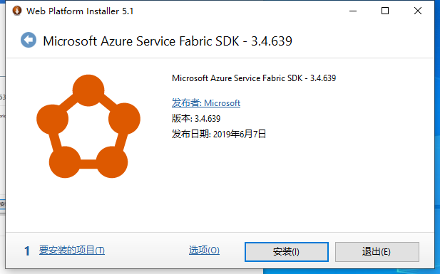
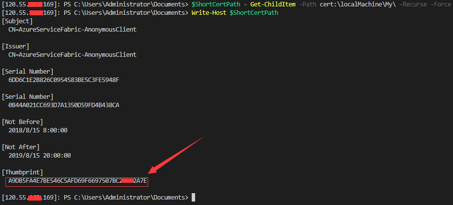
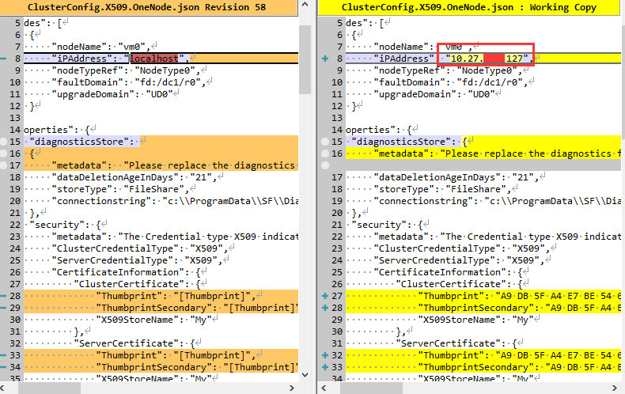

## 写在前面

我在写这篇实践文档前得到了许多Service fabric技术大牛技术指点与支持，如微软的：wu pin、社区技术大牛：朱永光等，非常感谢他们的指点。

Service fabric的优势，在网上已经有很多介绍了，我这里就不详细介绍了，如果你是初学者，恰好又看到这篇文章，那么，请你先移步到这里 [Service Fabric 分布式系统平台](https://docs.microsoft.com/zh-cn/azure/service-fabric/)，先了解Service fabric的一些基本情。我们在开发、使用Service fabric前必须要先要了解以下几个问题：

### 开发、生产环境的区别
Service fabric 开发环境与生产环境的安装方式是不一样的，在最初的时候，估计多数人都不会先去认真通读, [Service Fabric](https://docs.microsoft.com/en-us/azure/service-fabric/ "Service Fabric Documentation") 官方文档，而是在先在网上找一些简化入门的文档，简单读完后就凭借自己的过往开发、生产环境的安装的经验就马上开始了。但是 Service fabric开发、生产环境的安装与使用并不是跟过往经验一样，一路"Next"就可以配置好的，所以需要大家在上手前，尽量通读熟悉 [Service Fabric](https://docs.microsoft.com/en-us/azure/service-fabric/ "Service Fabric Documentation") 官方文档后，有一个较熟悉的概览后在进一步动手。基于Service fabric服务的大规模应用程序的开发工具建议选择最新版本的Visual Studio 2019，至于Visual studio 2015/2017也是可以的，但Service fabric 6.5是最后一个支持Visual studio 2015集成环境开发的版本。
### 安装开发环境的几个种方式
- Windows Web Platform Installer方式新增:使作x509证书安装群集pg04

    这种有界面安装方式建议在安装好Visual Studio 2019集成开发环境后进行，下载地址是：[MicrosoftAzure-ServiceFabric-CoreSDK](https://webpihandler.azurewebsites.net/web/handlers/webpi.ashx/getinstaller/MicrosoftAzure-ServiceFabric-CoreSDK.appids "MicrosoftAzure-ServiceFabric-CoreSDK.exe")
    下图是Windows Web Platform Installer安装图
    
- PowerShell脚本安装方式
    脚本安装方式安装方式比以上有界面安装方式简单，首先以管理员方式打开PowerShell，然后进行以下简单几个步骤即可完成；
    + 在PowerShell中安装 [Chocolatey](https://chocolatey.org/install "Installing Chocolatey") 环境
    
        > ` Set-ExecutionPolicy Bypass -Scope Process -Force; iex ((New-Object System.Net.WebClient).DownloadString('https://chocolatey.org/install.ps1')) `
    + 安装系统中使用的下载工具
        >` choco install webpicmd -y `
    + 安装Service fabric SDK
        >` webpicmd.exe /Install /AcceptEula /SuppressReboot /Products:MicrosoftAzure-ServiceFabric-CoreSDK `
        
开发环境不适用于生产部署，只用于模拟测试一定规模节点的应用程序，最小化模拟上线情景，也用于应用程序在Service fabric中的调试与测试。
### 创建生产环境方式
生产环境相对于开发环境安装可能更容易一些，但是生产环境有二种模式的集运行与管理方式，一是基于X509证书保护方式运行的群集，另外一种是UnSecure方式下运行的群集，接下来我们分步骤介绍一下基于X509证书保护下的安全群集的安装过程,基于UnSecure方式的安装过程基本与本文类似，只是不在安装过程中使用到X509证书。

## 基于X509安全证书安装生产群集
安装前的准备工作(本文是基于Windows Server 2012以上系列服务器的生产环境安装，也可以把Servie fabric群集同样部署到linux上，这部分会在后续文章中讲解)(这部分在部署实践时得到了微软Wu Ping的支持)
- Windows Server 2019,服务器数量5台(可向国内、国外云服务商购买)
- 通配符域名证书一个(向正式的安全证书提供商购买)
- 把所有服务器放在一个极低网络延迟且在同一个局域网络中
### 生产服务器系统中各网络服务开启
在准备好的所有服务器中，通过远程桌面方式（也可以通过云商API方式）开启以下服务,以下脚本命令在服务器中执行
> ` Set-NetFirewallProfile -Profile Domain,Public,Private -Enabled False `  
` Restart-Service RasAuto -Verbose `  
` Restart-Service RpcLocator -Verbose `  
` Restart-Service RemoteRegistry -Verbose `  
` Set-Service -Name RemoteRegistry -StartupType Automatic -Status Running -Verbose `  
`Enable-PSRemoting -Force -Verbose `  
`Restart-Service WinRM -Verbose `   
以上方式把全部把所有要群集到一起的服务器最基本的通信等方式配置完成了，这些配置是为安装Service fabric前做准备，接下就是选择其中一台服务器对其进行安装群集Seed节点服务；
### 生产环境“安装脚本、脱机安装包”的准备
群集有二种，一种是One Node(One Seed)，一种Multi Node(Multi Seed)，其中Seed的个数是构成不同级别稳定性的群集必要数, 具体信息请参考 [Service Fabric 群集容量规划](https://docs.microsoft.com/en-us/azure/service-fabric/service-fabric-cluster-capacity "Service Fabric 群集容量规划")；下面我们介绍多台服务器 One Seed 方式的安装；
#### 对要群集到一起所有服务器进行证书安装
要使用X509证书保护你未来运行的群集系统，那么就必须在安装Service fabric前先在所有的服务器提前安装所需要的证书，生产环境建议使用三个证书，具体请参考相关文档 [Service fabric安全性](https://docs.azure.cn/zh-cn/service-fabric/service-fabric-best-practices-security)，[证书配置升级](https://docs.azure.cn/zh-cn/service-fabric/service-fabric-cluster-config-upgrade-windows-server) 等相关文档
- 远程桌面方式：手动连接到每台服务器，然后通过界面引导方式添加
- 本地客户机管理方式：通过PowerShell远程方式(也可以通过远程桌面进入打开PowerShell)连接到对应用服务器，然后对其执行脚本安全证书
- 云商管理服务器接口处理：这种方式是利用云商的管理服务器的API接口，一次性进行对所有服务器进行证书安装
#### 安装One Seed节点群集
- 下载Service fabric安装脚本和离线安装包
    - 在PowerShell中下载安装脚本和离线安装包  
    >` Import-Module BitsTransfer `  
    ` Start-BitsTransfer -Source https://download.microsoft.com/download/8/3/6/836E3E99-A300-4714-8278-96BC3E8B5528/6.5.639.9590/Microsoft.Azure.ServiceFabric.WindowsServer.6.5.639.9590.zip -Destination c:\ -TransferType Download `  
    ` Start-BitsTransfer -Source https://download.microsoft.com/download/B/0/B/B0BCCAC5-65AA-4BE3-AB13-D5FF5890F4B5/6.5.639.9590/MicrosoftAzureServiceFabric.6.5.639.9590.cab -Destination c:\ -TransferType Download `  
    ` Expand-Archive .\Microsoft.Azure.ServiceFabric.WindowsServer.6.5.639.9590.zip -DestinationPath c:\sf `  
    
    上面解压到c:\sf目录里的文件就是在Windows下使用安装生产或者测试环境的便捷脚本，具体目录中每个文件的作用请参考：[Contents of Service Fabric Standalone package for Windows Server](https://docs.microsoft.com/en-us/azure/service-fabric/service-fabric-cluster-standalone-package-contents)  
    我们使用到的几个安装脚本文件分别是：  
    - 测试群集服务器与群集安装配置文件正确性：TestConfiguration.ps1
    - 基于X509证书下的安全群集One Seed节点配置文件：ClusterConfig.Windows.X509.OneNode.json  
    - 创建群集脚本：CreateServiceFabricCluster.ps1
    我们只需要以上二个PowerShell和一个配置文件即可进行生产群集安装。
   　
- 配置安装脚本中的服务器节点地址
    - One Node 节点配置，配置：                 
        - 证书信息获取  
        红色部分就是获取到安装在服务器上的证书信息  
        
        - 安装脚本配置  
        ClusterConfig.Windows.X509.OneNode.json 文件中的服务器地址与证书信息，配置文件中的证书信息我们采用“证书指纹”配置方式进行群集安装脚本进行参数配置,下图中示意了部分配置;  
        
- 执行脚本安装
    - 用脚本测试目标机器是否配置正确（切换到安装脚本目录）  
    > ` .\TestConfiguration.ps1 -ClusterConfigFilePath .\ClusterConfig.X509.OneNode.json -FabricRuntimePackagePath .\6.5.cab `
    - 执行群集单节点安装  
    > ` .\CreateServiceFabricCluster.ps1 -ClusterConfigFilePath .\ClusterConfig.X509.OneNode.json -FabricRuntimePackagePath .\6.5.cab `
#### 用X509安全证书方式连接至已安装成功的群集节点
#### 向已有的One Seed节点群集中添加节点
### 使用脚本进行安装
### 群集运行测试
### 参考资源
